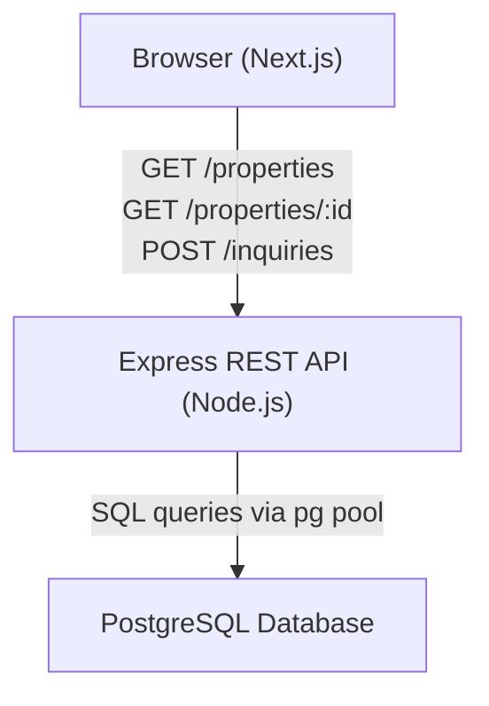

# Design Document: Real Estate App

## Overview

A Purplebricks-style MVP full-stack real estate web application. Users can browse property listings, filter them, view property details, and submit contact inquiries. The system is a monorepo with a Next.js frontend, a Node.js/Express REST API backend, and a PostgreSQL database.

The architecture follows a classic three-tier pattern: browser client → REST API → relational database. The frontend is a Next.js app using React Server Components where appropriate and client-side data fetching for interactive pages. The backend is a thin Express API with validation middleware and a PostgreSQL connection pool.

## Architecture



### Monorepo Layout

```
/
├── frontend/          # Next.js application
│   ├── app/           # App Router pages and layouts
│   ├── components/    # Shared React components
│   ├── lib/           # API client helpers
│   └── .env.example
├── backend/           # Express API
│   ├── src/
│   │   ├── routes/    # Express routers
│   │   ├── middleware/ # Validation, error handling
│   │   └── db/        # pg pool and query helpers
│   ├── migrations/    # SQL migration files
│   └── .env.example
└── README.md
```

## Components and Interfaces

### Backend

#### Express Application (`backend/src/app.js`)
- Mounts routers for `/properties` and `/inquiries`
- Registers global error-handling middleware
- Exports the app instance for testing

#### Properties Router (`backend/src/routes/properties.js`)
- `GET /properties` — query params: `minPrice`, `maxPrice`, `location`, `propertyType`
- `GET /properties/:id` — path param: `id`

#### Inquiries Router (`backend/src/routes/inquiries.js`)
- `POST /inquiries` — body: `{ propertyId, name, email, message }`

#### Validation Middleware (`backend/src/middleware/validate.js`)
- Validates inquiry body fields; returns 400 with missing field list
- Validates email format with a regex; returns 400 on mismatch
- Checks `propertyId` existence; returns 422 if not found

#### DB Module (`backend/src/db/pool.js`)
- Exports a `pg.Pool` instance configured from `DATABASE_URL`
- All query functions return plain JS objects (no ORM)

### Frontend

#### Pages (Next.js App Router)
- `/` — Home page: hero search, featured listings
- `/listings` — Listings page: full grid + filter sidebar
- `/listings/[id]` — Property Detail page: full details + contact form

#### Components
- `PropertyCard` — thumbnail, title, price, location; links to detail page
- `FilterPanel` — controlled inputs for minPrice, maxPrice, location, propertyType
- `ContactForm` — name, email, message fields with client-side validation
- `LoadingSpinner` — shown during in-flight fetches
- `ErrorMessage` — displays API or network errors

#### API Client (`frontend/lib/api.js`)
- `getProperties(filters)` — `GET /properties` with query string
- `getProperty(id)` — `GET /properties/:id`
- `submitInquiry(payload)` — `POST /inquiries`
- Base URL read from `NEXT_PUBLIC_API_URL`

## Data Models

### Property

```typescript
interface Property {
  id: number;
  title: string;
  description: string;
  price: number;           // in pence/cents as integer, or decimal
  location: string;
  property_type: string;   // e.g. "house", "flat", "studio"
  bedrooms: number;
  bathrooms: number;
  image_url: string;
  created_at: string;      // ISO 8601 timestamp
}
```

### Inquiry

```typescript
interface Inquiry {
  id: number;
  property_id: number;
  name: string;
  email: string;
  message: string;
  created_at: string;      // ISO 8601 timestamp
}
```

### Database Schema (PostgreSQL)

```sql
CREATE TABLE properties (
  id            SERIAL PRIMARY KEY,
  title         TEXT NOT NULL,
  description   TEXT NOT NULL,
  price         NUMERIC(12, 2) NOT NULL,
  location      TEXT NOT NULL,
  property_type TEXT NOT NULL,
  bedrooms      INTEGER NOT NULL,
  bathrooms     INTEGER NOT NULL,
  image_url     TEXT NOT NULL,
  created_at    TIMESTAMPTZ NOT NULL DEFAULT NOW()
);

CREATE TABLE inquiries (
  id          SERIAL PRIMARY KEY,
  property_id INTEGER NOT NULL REFERENCES properties(id),
  name        TEXT NOT NULL,
  email       TEXT NOT NULL,
  message     TEXT NOT NULL,
  created_at  TIMESTAMPTZ NOT NULL DEFAULT NOW()
);
```

### Filter Query Parameters

```typescript
interface PropertyFilters {
  minPrice?: number;
  maxPrice?: number;
  location?: string;
  propertyType?: string;
}
```

### Inquiry Payload

```typescript
interface InquiryPayload {
  propertyId: number;
  name: string;
  email: string;
  message: string;
}
```


## Correctness Properties

*A property is a characteristic or behavior that should hold true across all valid executions of a system — essentially, a formal statement about what the system should do. Properties serve as the bridge between human-readable specifications and machine-verifiable correctness guarantees.*

### Property 1: Filter correctness

*For any* set of properties in the database and any combination of filter parameters (`minPrice`, `maxPrice`, `location`, `propertyType`), every property returned by `GET /properties` must satisfy all supplied filter criteria simultaneously.

**Validates: Requirements 1.2**

---

### Property 2: No-filter returns all

*For any* set of properties stored in the database, calling `GET /properties` with no filter parameters must return all of them — no more, no less.

**Validates: Requirements 1.3**

---

### Property 3: Property detail round-trip

*For any* valid Property object inserted into the database, fetching it by its ID via `GET /properties/:id` must return an object whose fields exactly match the inserted data.

**Validates: Requirements 2.2**

---

### Property 4: Inquiry creation round-trip

*For any* valid inquiry payload (with an existing `propertyId`, non-empty `name`, valid `email`, non-empty `message`), submitting it via `POST /inquiries` must return HTTP 201 with a response body whose `propertyId`, `name`, `email`, and `message` fields match the submitted values.

**Validates: Requirements 3.2**

---

### Property 5: Missing required fields rejected

*For any* non-empty subset of required inquiry fields (`propertyId`, `name`, `email`, `message`) that is omitted from the request body, `POST /inquiries` must return HTTP 400 and the response body must list every omitted field.

**Validates: Requirements 3.3**

---

### Property 6: Invalid email rejected by API

*For any* string that does not conform to a valid email address format, submitting it as the `email` field in `POST /inquiries` must result in an HTTP 400 response with a validation error.

**Validates: Requirements 3.4**

---

### Property 7: created_at auto-populated

*For any* row inserted into `properties` or `inquiries` without an explicit `created_at` value, the database must assign a non-null timestamp that is close to the current time.

**Validates: Requirements 4.4**

---

### Property 8: Home page search navigates with term

*For any* non-empty search term entered on the Home page, submitting the search must navigate the user to `/listings` with that exact term present as a query parameter.

**Validates: Requirements 5.2**

---

### Property 9: Filter change triggers re-fetch with correct params

*For any* filter value change on the Listings page, the frontend must call `GET /properties` with query parameters that reflect the current state of all active filters.

**Validates: Requirements 6.3**

---

### Property 10: Property card click navigates to correct detail page

*For any* property displayed on the Listings page, clicking its card must navigate to `/listings/:id` where `:id` matches that property's ID.

**Validates: Requirements 6.6**

---

### Property 11: Property detail page renders all required fields

*For any* Property object returned by the API, the Property Detail page must render the `title`, `description`, `price`, `location`, `property_type`, `bedrooms`, `bathrooms`, and `image_url` fields visibly in the page output.

**Validates: Requirements 7.2**

---

### Property 12: Contact form submits correct payload

*For any* valid combination of `name`, `email`, and `message` values entered in the contact form, submitting the form must call `POST /inquiries` with a payload containing those exact values plus the current page's `propertyId`.

**Validates: Requirements 8.2**

---

### Property 13: Empty required fields block submission

*For any* non-empty subset of required contact form fields (`name`, `email`, `message`) left empty, attempting to submit the form must display inline validation errors for each empty field and must not call `POST /inquiries`.

**Validates: Requirements 8.5**

---

### Property 14: Invalid email blocks form submission

*For any* string that does not match a valid email format entered in the contact form's email field, attempting to submit must display an inline validation error and must not call `POST /inquiries`.

**Validates: Requirements 8.6**

---

## Error Handling

### API Layer

| Scenario | HTTP Status | Response Shape |
|---|---|---|
| DB unavailable | 503 | `{ "error": "<descriptive message>" }` |
| Property not found | 404 | `{ "error": "Property not found" }` |
| Missing inquiry fields | 400 | `{ "error": "Missing required fields", "fields": ["field1", ...] }` |
| Invalid email format | 400 | `{ "error": "Invalid email address" }` |
| Non-existent propertyId | 422 | `{ "error": "Property does not exist" }` |
| Unhandled server error | 500 | `{ "error": "Internal server error" }` |

All error responses use `Content-Type: application/json`. The global error-handling middleware in Express catches unhandled errors and maps them to 500.

### Frontend Layer

- **Loading states**: `LoadingSpinner` shown while any fetch is in-flight; hidden on completion.
- **API errors**: `ErrorMessage` component displays the `error` field from the API response body, or a generic "Something went wrong" fallback for network errors.
- **404 on detail page**: Renders a "Property not found" message with a link back to `/listings`.
- **Form validation errors**: Inline error messages rendered beneath each invalid field; form submission is blocked until all fields are valid.
- **Inquiry success**: Success banner shown and form fields reset to empty after HTTP 201.

### Database Layer

- Foreign key constraint on `inquiries.property_id` prevents orphaned inquiries at the DB level (defence-in-depth alongside the API's 422 check).
- `NOT NULL` constraints on all required columns prevent partial inserts.

---

## Testing Strategy

### Backend Unit Tests

Use **Jest** + **supertest** for HTTP-level tests with a mocked `pg.Pool`.

- Example tests for: endpoint existence, 404 on missing ID, 503 on DB failure, 422 on missing propertyId, foreign key constraint behaviour.
- Property-based tests use **fast-check** (minimum 100 iterations each).

### Backend Property-Based Tests (fast-check)

Each test is tagged with `// Feature: real-estate-app, Property N: <property_text>`.

| Property | Test Description |
|---|---|
| Property 1 | Generate random property sets + filter combos; assert all results satisfy filters |
| Property 2 | Insert random property sets; fetch with no filters; assert full set returned |
| Property 3 | Generate random Property objects; insert + fetch by ID; assert round-trip equality |
| Property 4 | Generate random valid inquiry payloads; POST + assert response matches input |
| Property 5 | Generate random subsets of required fields to omit; assert 400 + missing field list |
| Property 6 | Generate random invalid email strings; assert 400 |
| Property 7 | Insert random rows without created_at; assert created_at is set and recent |

### Frontend Unit Tests

Use **Jest** + **React Testing Library** with mocked `fetch` / API client.

- Example tests for: page rendering, loading indicator, error message display, 404 handling, form reset on success, error display on failure.
- Property-based tests use **fast-check**.

### Frontend Property-Based Tests (fast-check)

| Property | Test Description |
|---|---|
| Property 8 | Generate random search terms; simulate submission; assert navigation URL |
| Property 9 | Generate random filter values; simulate filter changes; assert API called with correct params |
| Property 10 | Generate random property IDs; render cards; simulate click; assert navigation |
| Property 11 | Generate random Property objects; render detail page; assert all fields present |
| Property 12 | Generate random valid form data; simulate submission; assert POST payload |
| Property 13 | Generate random subsets of empty fields; attempt submission; assert inline errors + no API call |
| Property 14 | Generate random invalid email strings; attempt submission; assert inline error + no API call |

### Integration Tests

- Run against a real PostgreSQL instance (e.g., in CI via Docker).
- Cover: full request/response cycle for all three endpoints, foreign key constraint enforcement, filter combinations with real data.

### Smoke Tests

- Assert `frontend/` and `backend/` directories exist with expected entry points.
- Assert `.env.example` files contain required variable names.
- Assert migration file exists and contains `CREATE TABLE` and at least 5 `INSERT` statements.
- Assert DB schema has correct columns via `information_schema` query after migration.
